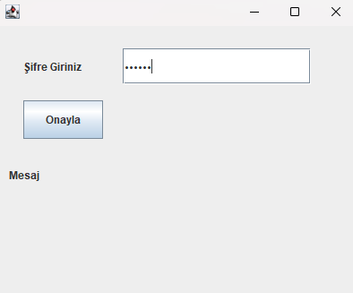
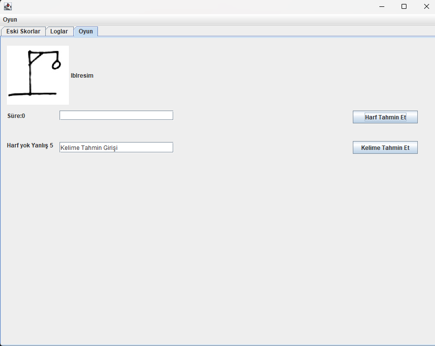
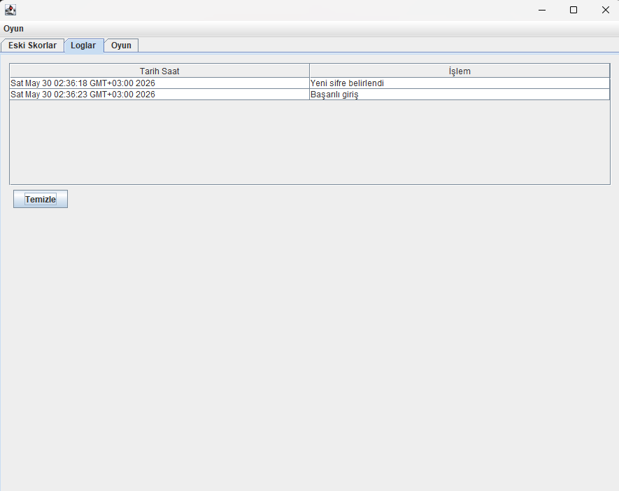
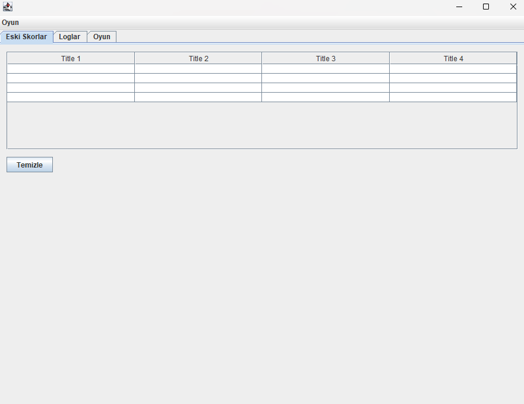

# Adam Asmaca Oyunu 

Bu proje, Programlama II dersi dönem ödevi kapsamında Java Swing kütüphanesi kullanılarak geliştirilmiş masaüstü tabanlı bir **Adam Asmaca** oyunudur. Oyun,şifreli giriş sistemi, dinamik harf alanları, anlık loglama ve geçmiş skor takibi gibi özelliklere sahiptir.

---

##  Gerekli Klasör ve Dosya Yapısı

Programın koduna müdahale edilmeden çalışabilmesi için `C:\` dizininde aşağıdaki klasör yapısı ve dosyalar bulunmalıdır:

* **Resim Klasörü:** `C:\P2Oyun\Resimler` (İçinde `1.jpg`den `11.jpg`ye kadar 11 adet aşama resmi olmalıdır).
* **Metin Dosyaları Klasörü:** `C:\P2Oyun\TXTDosyalar`
  * `kelimeler.txt` (En az 6 harfli 30 adet kelime)
  * `sifre.txt` (Giriş şifresi)
  * `log.txt` (Giriş denemelerinin kayıtları)
  * `oyunlar.txt` (Oyun sonuçları ve süreleri)

---

##  Özellikler

* **Güvenli Giriş:** İlk açılışta şifre belirlenir. Sonraki girişlerde 3 kez hatalı şifre girilirse program kapanır.
* **Anlık Loglama:** Her giriş denemesi tarih ve saat bilgisiyle `log.txt` dosyasına kaydedilir.
* **Dinamik Oyun Alanı:** Seçilen kelimenin harf sayısı kadar dinamik `JLabel` oluşturulur ve harfler `*` olarak gizlenir.
* **Görsel Takip:** Her yanlış tahminde adam asmaca görselleri sırayla ekrana gelir.
* **Skor ve Log Yönetimi:** Eski skorlar ve giriş logları `JTable` ile listelenir; şifre doğrulaması yapılarak temizlenebilir.

---

## Uygulama Ekran Görüntüleri

### 1. Giriş ve Şifre Kontrol Ekranı

### 2. Oyun Oynama Alanı (JTabbedPane)

### 3. Log Listesi (JTable)

### 4. Geçmiş Skorlar (JTable)

---
**Geliştirici:** Ahmet  
**Öğrenci Numarası:** 2416501029  
**Üniversite:** Süleyman Demirel Üniversitesi - Bilgisayar Mühendisliği Bölümü
